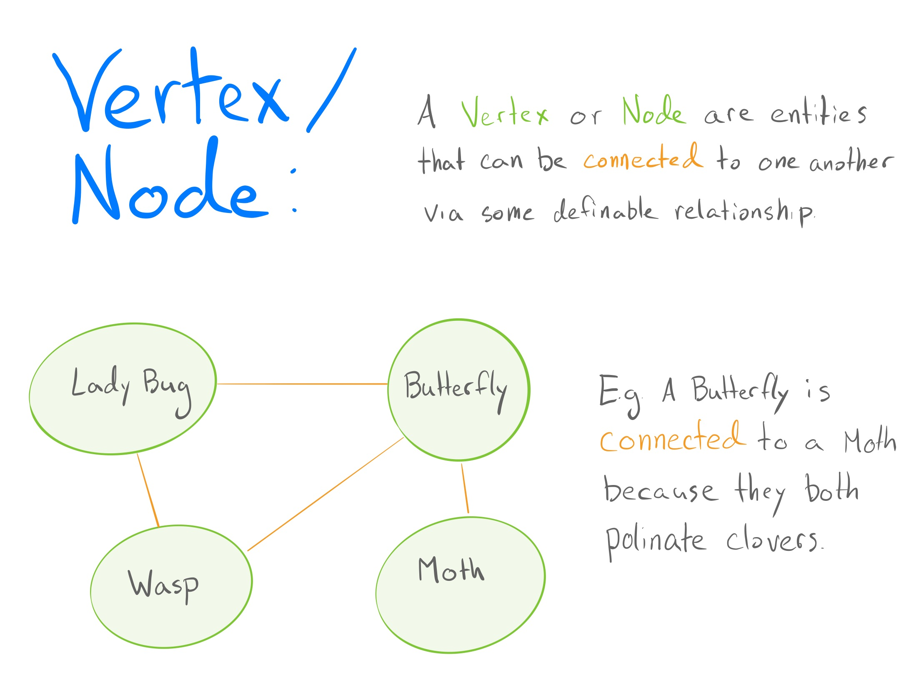
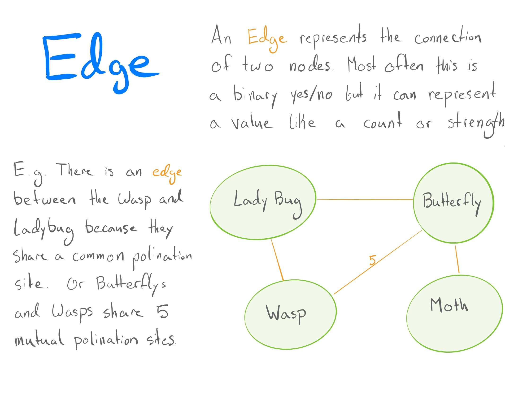
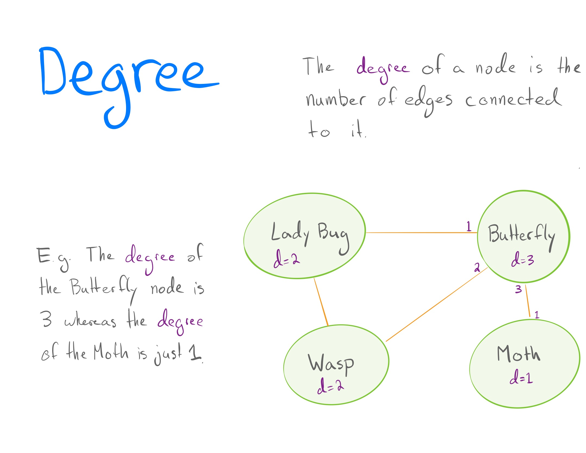
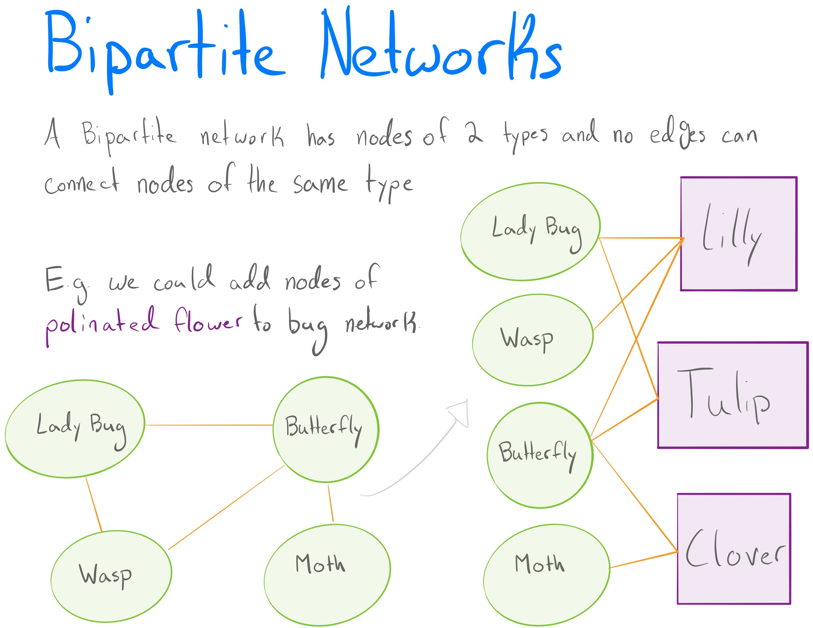
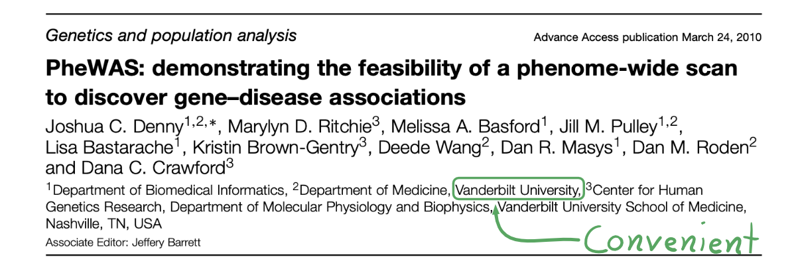
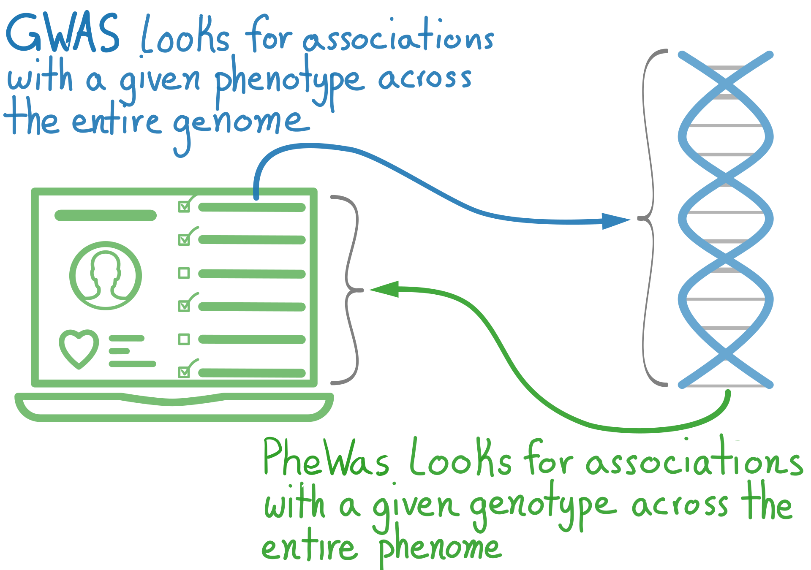
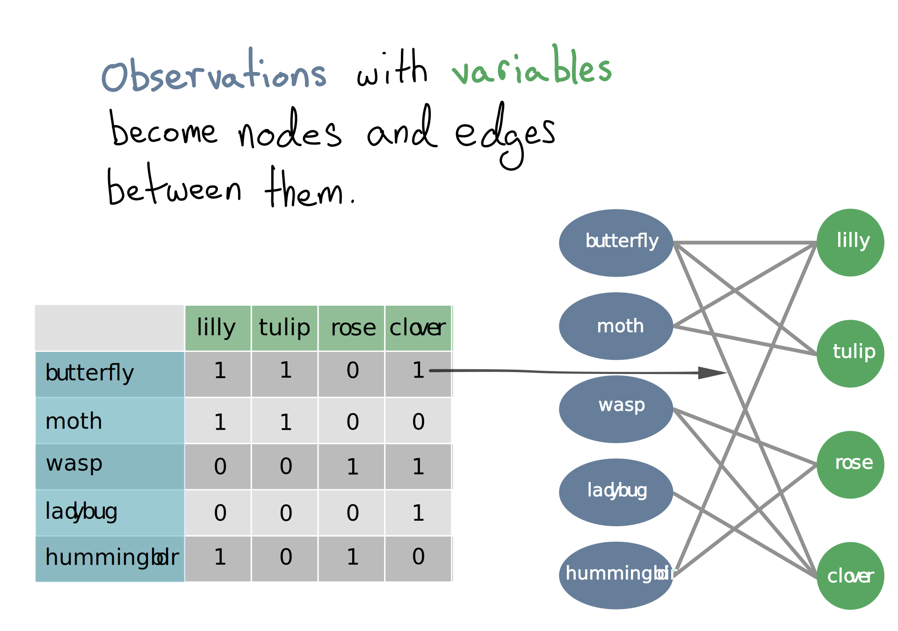
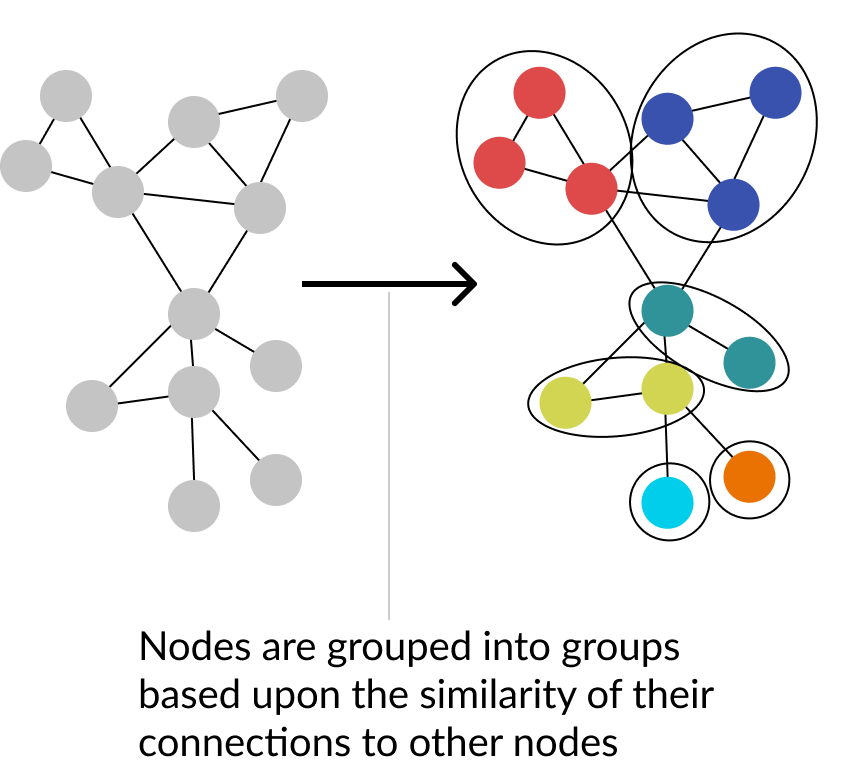
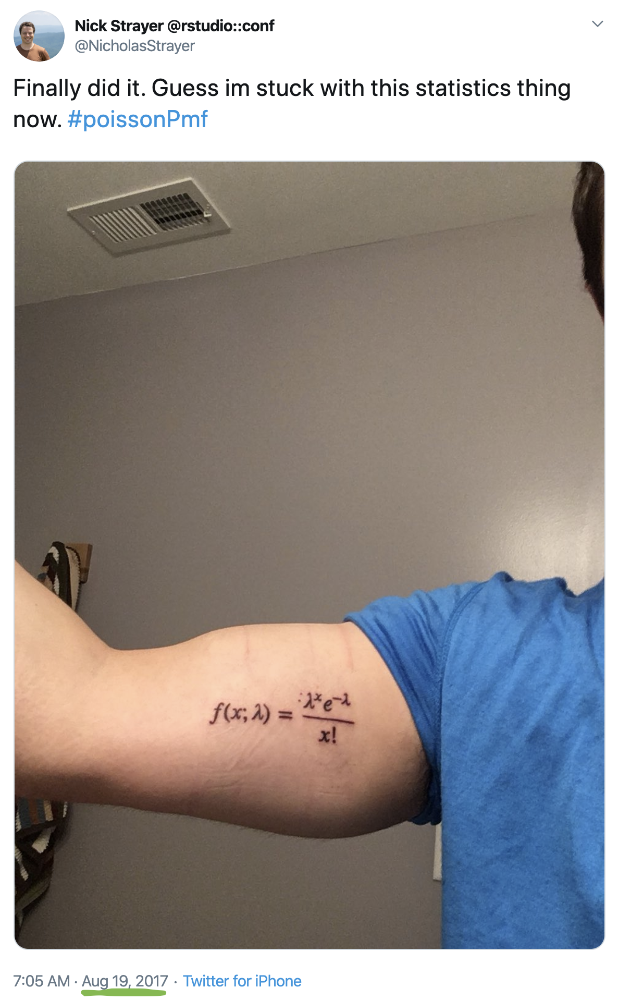
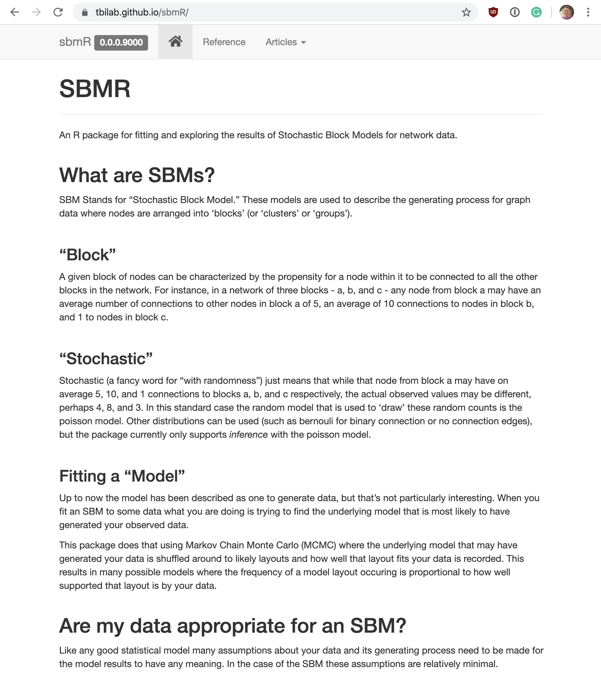

```{r setup, include = FALSE}
knitr::opts_chunk$set(
  fig.dim=c(5, 4), 
  fig.retina=2, 
  out.width="100%",
  message=FALSE,
  warning=FALSE
  # ,
  # cache = TRUE
  )

library(knitr)
set.seed(42)

fa <- function(name, size = 'lg',  ...) icon::fa(name, fixed_width = TRUE, size = size, color = "#e34a33", ...)
library(r2d3)
```

class: middle

.pull-left[
# Layout


- Networks, what and why
- What is an SBM?
- SBMs in use

]
.pull-right[

## Slides

<div style="text-align:right; font-size: 5rem;">

`r fa("arrow-down")`

</div>
]


---
class:middle

# Networks, what and why


---

class: middle




---

class: middle




---

class: middle




---

class: middle




---

# Electronic medical records (EHR)


In an effort to make healthcare more efficient EHR systems have become common in the US. 


.pull-left[
`r fa('file-invoice-dollar')` While originally made for billing purposes there is still a huge sum of information that, with careful effort, _hopefully_, can be extracted for research.

]
.pull-right[

`r fa('search')` In this presentation I will focus on the subset of EHR pertaining to billing codes: ICD9, ICD10, and Phecodes.
]


 )


---
# Biobanks

![:space 6] 

`r fa('piggy-bank')` Some hospitals have repositories of biological samples that can be matched to their EHR.

![:space 8] 

`r fa('syringe')` Data could be anything from plain unprocessed-plasma all the way to full single-cell sequencing. 

![:space 8] 

`r fa('dna')` Here I will focus on plain SNP-chip readings, aka presence or absence of a given marker at multiple points on the genome.


---


# PheWAS

![:space 5] 


In an effort to extract information from these data the technique PheWAS was made.

![:space 8] 




---

## Concept
![:spacePx 5] 




---

## The univariate problem

![:space 15]

`r fa('hand-point-up')` PheWAS looks at one genotype `r icon::fa('arrow-right')` phenotype association at a time.


![:space 12]

.pull-left[
`r fa('stream')` This gives us the multiple-comparisons problem.
]
.pull-right[
`r fa('project-diagram')`Also, does the world work like this? 
]


---


# Changing how we   these data



---


# What about ...?

.pull-left[
- Questions arise like "who are these people similar to and why?"

- Deep Learning?
  - Lack of interpretability
  - Needs specialization for bipartite networks

- Need to acknowledge the limitations of the data
  - Use a model that fits the data
]
.pull-right[

]


---
class: middle

# The tochastic lock odel

> [Non-SBM attempts] express implicit modeling restrictions and assumptions in their output... Stochastic block models have the advantage of explicitly stating the underlying assumptions, which improves the interpretability of the results.

Larremore et al. - [Efficiently inferring community structure in bipartite networks](https://arxiv.org/pdf/1403.2933.pdf)

---

# In a nutshell

.pull-left[


Models the community structure of nodes by collapsing them into blocks


Defines a probability distribution over all possible community forms
  - Therefor is a 'generative' model
]
.pull-right[

]


---


# An equation for validity

<div style="margin-top:-75px;">

</div>

---

# That looks familiar...




---

# How they're fit

![:space 10]

- Most often used as a bayesian model
  - Uninformative priors on number of groups and group partitioning
  - Get uncertainty directly from posterior
  
![:space 10]

- Sometimes fit using expectation maximization
  - For edge distributions that don't have nice posterior formulations
  - Uncertainty usually not accessed but could be done through resampling techniques
  

---


class: middle

# Tools for using SBMs

.pull-left[
##[`Graph-Tool`](https://graph-tool.skewed.de/)
- Python library
- Lots and lots of features beyond SBMs

##[`sbmR`](http://nickstrayer.me/sbmR/index.html)
- R package
- Focused just on SBMs
- Actively developing
]
.pull-right[
.center[.iconed[📦]]
]

	
---

class: middle

# Using SBMs (with R)

---

# What exactly is `sbmR`?

.pull-left[

![:spacePx 90]

- Native R package (kinda)

- Fits SBMs

- Investigates uncertainty of found structure by sampling from bayesian posterior

- Provides (a growing list of) visualizations to communicate results

![:spacePx 30]


### [nickstrayer.me/sbmR/](http://nickstrayer.me/sbmR/)

]

.pull-right[
.shadowed[

]
]


---
class: middle

# What is needed to use it?

.pull-left[
### Data

.bullet_emoji[✔️] Data that can be represented as nodes and edges between those nodes
- Patients with diagnoses
- Genomes with mutations
- Social relationships
- ...

.bullet_emoji[🚫] Does not (yet) support non-discrete edges
- Correlations between variables
- Distances between cities
- ...
]


.pull-right[

### __Mentality__


.bullet_emoji[🍱] Interest in __how__ and __why__ your data cluster together

![:spacePx 90]

.bullet_emoji[⚖️] A desire to understand how stable clusters are

]


---

class: middle, center

## [Demo](http://nickstrayer.me/sbmR/articles/sampling_from_posterior.html)


---

class: middle

# Resources

![:space 15]

[Bayesian stochastic blockmodeling](https://arxiv.org/pdf/1705.10225.pdf): Paper by Tiago Peixoto covering SBMs from the ground up. 

![:space 5]


[Efficiently inferring community structure in bipartite networks](https://arxiv.org/pdf/1403.2933.pdf): Paper looking at the use of SBMs for bipartite networks.

![:space 5]


[Graph-Tool Inference Docs](https://graph-tool.skewed.de/static/doc/demos/inference/inference.html): Documentation for Graph-Tool library that serves as a great intro to the math and logic behind SBMs. 


